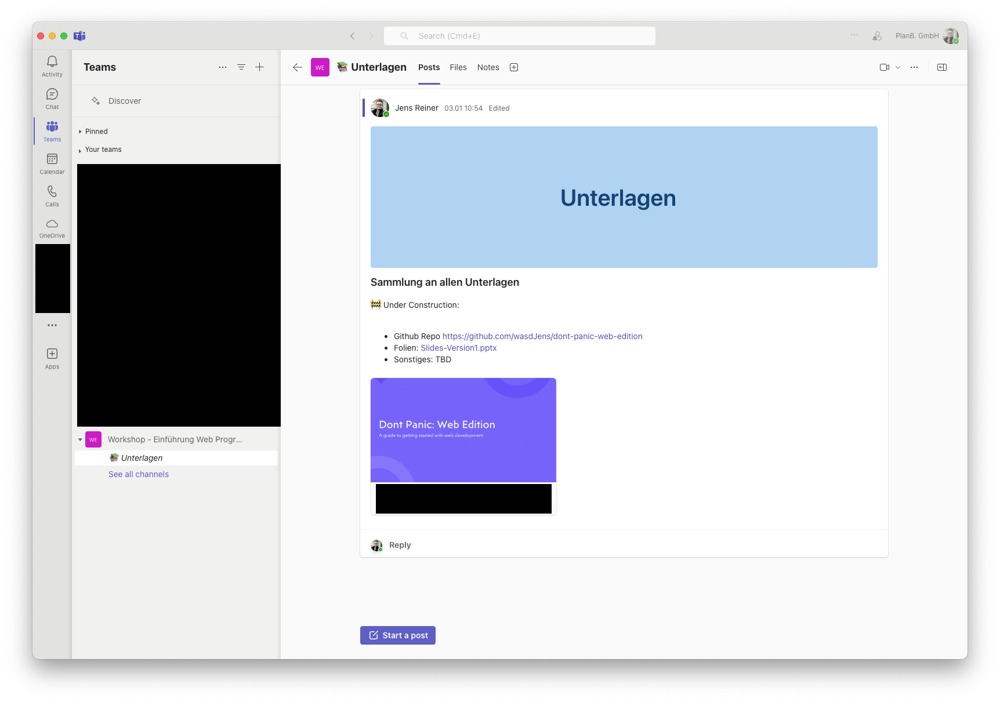
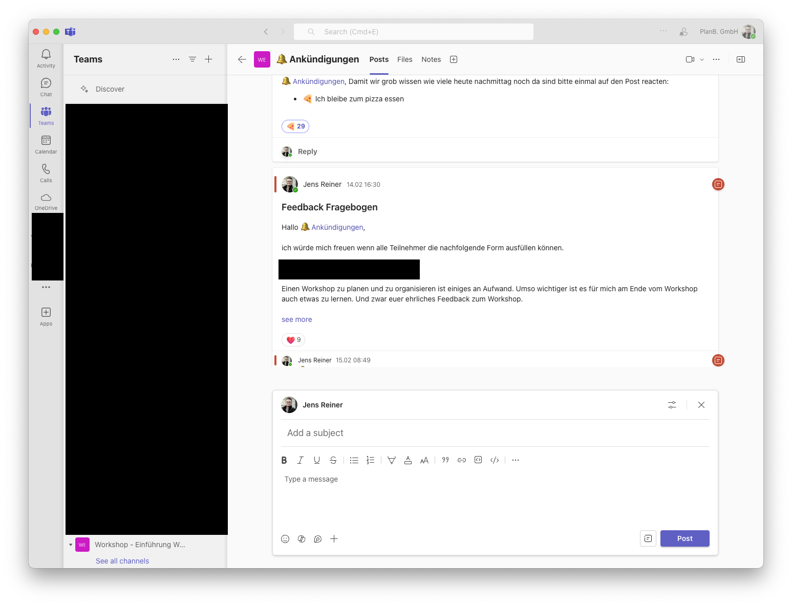

# Component Driven User Interfaces

Immer mehr Anwendungen werden als Web Applikation realisiert. Besonders im Zeitalter von Cloud Adoption werden klassische Legacy Anwendungen schnell als Web Anwendung migriert. Auch bieten Web Applikationen den schnellsten Weg Endnutzern neue Features und Funktionen bereitzustellen. 

Um diese immer komplexeren Anwendungen zu realisieren hat sich das das Konzept User Interfaces in viele Bausteine zu zerlegen und diese als Komponenten zu entwickeln durchgesetzt.

Im nachfolgenden schauen wir uns einmal die Hintergründe für immer komplexere Anwendungen an und wie man mit Component Design einfach Anwendungen umsetzen kann.

## Webseite vs. Web Applikation

Webseiten sind HTML Dokumente die Content darstellen. Ein Web Server stellt das HTML Dokument bereit und der Browser stellt entsprechend dem HTML Dokument die Webseite dar. In den meisten Fällen ist der Inhalt dabei statisch und kann nicht direkt vom Nutzer manipuliert werden. Wenn der User eine andere Seite aufrufen möchte, wird eine neue Anfrage an den Server gestellt und die neue Seite wird vom Server geladen.

Aber immer mehr Software Lösungen werden als Web Applikationen realisiert in denen der Nutzer direkt mit der Anwendung interagieren kann. Mit der Einführung von ES6 und Browser Engines die moderenes JavaScript unterstützen konnte man diese Art der Anwendungen von nun an auch als Webseiten realiseren. Zu dieser Zeit begann auch die Etablierung von modernen Frameworks / Libraries die eine Abstraktion für die Interaktion mit dem DOM anbieten und die Entwicklung von Web Applikationen vereinfachen (Bspw. Angular, React etc.)

Diese Art der Web Applikationen werden häufig als Single Page Applications bezeichnet (SPA). Anders als bei klassischen Webseiten wird dabei inital eine HTML Seite sowie das komplette JavaScript vom Server übertragen. Alle weiteren User Interaktionen wie bspw. navigieren zu einer anderen Seite werden dann direkt im Browser ausgeführt (Keine Kommunikation mit dem Web Server mehr notwendig - Laufen direkt auf dem Client PC).

Der Vorteil von SPAs liegt vor allem bei der Verfügbarkeit der Anwendung. Als Software Hersteller muss man keine Installation beim Kunden vornehmen sondern kann die Anwendung einfach über das Internet verteilen, welche von jedem modernen Betriebssystem direkt im Browser ausgeführt werden kann. 

Nach dem selben Prinzip lässt sich auch relativ einfach Plattform Unabhängige Software entwickeln und kann u.a. auch auf mobilen Geräten ausgeführt werden.

Aber wieso bauen wir SPAs anders als klassische Webseiten?

## Fallbeispiel Teams Oberfläche

In diesem Fallbeispiel sollen wir die Teams Oberfläche als Web Applikation umsetzen. Im ersten Schritt schauen wir uns die aktuelle Oberfläche an - Was fällt uns auf?

(Fun Fact - Teams ist im Hintergrund wirklich eine Web Applikation. Classic Teams hat AngularJS verwendet während das neue Teams auf React basiert siehe https://techcommunity.microsoft.com/t5/microsoft-teams-blog/microsoft-teams-advantages-of-the-new-architecture/ba-p/3775704)





- Teams ist eher eine Anwendung im Vergleich zu einer klassischen Webseite
- Teams hat sehr viele Elemente die eine User Interaktion anbieten
  - Chat, Channels, Meetings, Dateien, Apps in Apps etc.
- Teams ist in verschiedene Bereiche unterteilt
  - Header mit Informationen über eingeloggten User sowie die Suche
  - Navigation um zwischen Chat und Teams zu wechseln
  - Navigation innerhalb von Teams oder Chats
  - Entweder Chat Fenster oder Teams Channel mit Posts
- Viele UI Elemente werden wiederverwendet
  - Die Leiste ganz Links besteht immer aus einem Icon und einem Text
  - Ein Teams Channel hat immer einen Header mit folgenden Elementen:
    - Pfeil Zurück
    - Bild
    - Titel
    - Reiter mit unterschiedlichen Elementen
  - Ein Teams Channel Post sieht immer gleich aus mit folgenden Elementen:
    - Autor und Datum
    - Eigentlichen Inhalt
    - Reactions
    - Reply Funktion

Es sollte einem schnell auffallen das Teams viele Elemente wiederverwendet die in unterschiedlichen Use-Cases eingesetzt werden. Bspw. ist die Reply Funktion auf einen Channel Post die gleiche wie wenn man im Chat Fenster mit jemanden schreibt. Auch haben viele Elemente einen einheitlichen Look bspw. ist der Button "Start a post" der gleiche wie der "Post" Button wenn ich den Post anlegen möchte. Es unterscheidet sich nur der Text und das Icon.

Wie sieht also eine mögliche Umsetzung aus?

Ein häufiges Problem in der Umsetzung Applikationen ist, dass man versucht die gesamte Oberfläche in einem Stück zu entwickeln. Man bekommt meistens den finalen Design Entwurf für eine Ansicht und baut anhand dieser seine Oberfläche auf. 

Wenn man dann eine neue Seite oder Feature hinzufügen möchte ist es deutlich aufwendiger seine bestehende Oberfläche für einen zweiten Use Case anzupassen anstatt auf bestehende Elemente zurückzugreifen.

## Components & Bottom Up Konzept

Anstatt eine Oberfläche als gesamtes zu entwickeln kann man zuerst die einzelnen Bereiche einer Oberfläche identifizieren und die Elemente die immer wieder vorkommen. Die Elemente die immer wieder vorkommen definieren wir dann als Eigenständige Komponenten. Um einen Bereich der Oberfläche zu entwickeln verwenden wir dann diese Komponenten um eine größere neue zu bauen. Um eine gesamte Seite zu bauen verwenden wir dann diese Komponenten und "stecken" diese zusammen.

Man beginnt mit der kleinsten Component und baut sich eine Seite zusammen.

### Am Beispiel der Teams Seitenleiste

Um das Konzept einmal näher zu bringen möchten wir die Teams Seitenleiste nachbauen. Die Seitenleiste besteht aus einer Liste welche die einzelnen Bereiche anzeigt. Ein Bereich ist dabei mit einem Icon und einem Text dargestellt. Wenn ich den Bereich aktiv habe wird dieser farblich hervorgehoben. Ab einer gewissen Länge gibt es noch ein weiteres Menü das zusätzliche Optionen beinhaltet.

Wir definieren uns also folgende Komponenten:

- SVG-Icon
- Icon-Text

Aus diesen zwei Bausteinen können wir dann das eigentliche "Icon" definieren welches Intern die SVG Icon Komponente sowie den Icon Text nutzt. Wieso machen wir nicht beides direkt als eine Komponente?

Mit diesem fein granulaen Ansatz haben wir die Möglichkeit unsere Icon Komponente später zu erweitern und bspw. anstatt ein SVG Icon auch ein Bild anzuzeigen. Oder wir können das SVG Icon auch nutzen um eine reine Icon Button Komponent zu erstellen. Außerdem können wir über diesen zusätzlichen Wrapper steuern wie ein aktives Element hervorgehoben wird. Die reine Icon Component interessiert sich nicht ob das Icon Blau oder Grau ist. Wir übergeben einfach ein Icon welches angezeigt werden soll. Der Wrapper hingegen beinhaltet Logik um zu entscheiden welches Icon angezeigt wird.

Hier wird recht schnell ein weiteres Konzept von Komponenten klar - Eine Komponente sollte genau eine Aufgabe übernehmen. Die Icon-Text Komponente bspw. zeigt einfach einen übergebenen String an. Was der genaue String ist, ist dabei erstmal egal. Die Komponente hat ggf. nur Logik für das Styling vom Text dabei (Umbruch, Größe etc.).

Für die Entscheidung ob ein Element aktiv ist oder nicht benötigen wir auch einen State der sich diese Information merkt. Hier kommt ein weiteres Konzept von Komponenten hinzu. Eine Komponente hat immer einen internen Zustand der sich ändern kann. In diesem State kann bspw. das Ergebnis der Komponenten Logik gespeichert werden.

Jetzt fehlt noch die Möglichkeit von außen anzugeben ob ein Element aktiv ist oder nicht. Man könnte jetzt auf die Idee kommen in der Icon Wrapper Komponent die Logik zu implementieren wann ein Element aktiv ist oder nicht. Aber wäre es nicht besser wenn ich auch wieder von außen einfach sagen könnte ob ein Element aktiv ist oder nicht ohne alle Fälle in der Icon Komponente zu implementieren? Es kann ja bspw. sein ich verwende die Icon Komponente an einer Stelle wo es gar keine Unterscheidung gibt ob das Element aktiv ist oder nicht.

Komponenten müssen also Eigenschaften haben die wir von außen Beeinflussen können. In React / Vue nennt man diese Eigenschaften "props" in Angular hingegen einfach "Inputs". Mit diesen Inputs können wir bspw. auch angeben welche Icon die SVG-Icon Komponente anzeigen soll oder den Text an die Icon-Text übergeben.

Fassen wir einmal den Aufbau unserer Komponenten und der Konzepte zusammen:

- Eine Komponente sollte genau eine Aufgabe übernehmen
- Eine Komponente hat einen internen State
- Eine Komponente kann über Props / Inputs von außen beeinflusst werden

Aus der Sicht von Programmiersprachen ist eine Komponente also nichts anderes als eine Funktion:

- Eine Funktion löst genau eine Aufgabe 
- Eine Funktion kann sich intern Variablen und Werte zwischen speichern
- Eine Funktion kann Parameter entgegennehmen die den Ablauf der Funktion beeinflussen

Versuchen wir unsere drei Komponenten einmal als Funktion zu definieren:

```ts
function SvgIcon(props: { icon: string, color: string, size: number }) {
  return `<svg fill="${props.color}" width="${props.size}" height="${props.size}" viewBox="0 0 24 24">
    <path d="${props.icon}"></path>
  </svg>`;
}

function IconText(props: { text: string, color: string }) {
  return `<span style="color: ${props.color}">${props.text}</span>`;
}

function Icon(props: { icon: string, text: string, active: boolean }) {
  return `<div style="background-color: ${active ? 'blue' : 'white'}">
    ${SvgIcon({ icon: props.icon, color: 'black', size: 24 })}
    ${IconText({ text: props.text, color: 'black' })}
  </div>`;
}
```

Eine Komponente ist also nichts anderes als eine Funktion die Parameter bekommt und als Rückgabe ein Element liefert das die Komponente darstellt. In diesem einfachen Beispiel geben wir einfach einen HTML String zurück.

Mit der Icon Komponente können wir jetzt die nächste Komponente definieren für unsere Seitenleiste. Alle Seitenelemente als Liste darstellen. Folgende Aufgabe übernimmt dabei diese Komponente:

- Wir übergeben eine Liste von Elementen die wir darstellen möchten als Information
- Ab einer gewissen Länge die wir frei definieren können wird die Liste abgeschnitten und ein weiteres Menü angezeigt
- Die Komponente geht über die komplette Liste und erstellt für jedes Element eine Icon Komponente

Ab diesem Punkt können wir jetzt beliebig weiter machen und weiter oben in der Hierarchie eine neue Komponente erstellen die die Seitenleiste und den Content Bereich zusammenfügt. Diese Komponente kann dann wiederum in einer noch höheren Komponente eingebunden werden usw.

Wenn wir jetzt eine andere Seitenleiste an eine andere Position einfügen möchten, können wir einfach die Seitenleisten Komponente an der entsprechenden Stelle einbinden und eine andere Liste von Elementen übergeben. Am Ende haben wir einen Baukasten an Components die wir beliebig kombinieren können.

### Definition Komponenten

Komponenten sind standartisierte, wiederverwendbare Bausteine die ein Element von einer Oberfläche abbilden. Die Komponente beinhaltet dabei die Darstellung und Logik des Elements.

Komponenten können in anderen Komponenten zusammengefasst werden um vollständige Oberflächen zu erstellen.

## Components identifizieren

Woher weiß man was eine "gute" Component ist? Ein häufiges Problem ist das identifizieren von den richtigen Components und das Design von der Component selbst:

- Wie viel Komplexität sollte die Component beinhalten?
- Welche "API" nach außen benötigt meine Component damit andere diese wiederverwenden können?
- Gibt es Components die nur anzeigen und welche die Daten verarbeiten?
- Welchen State benötigt meine Component intern? 
- Hat meine Component Abhängigkeiten zu anderen und wie sehen diese aus?

Die Komplexität einer Component kann man in Grenzen halten wenn man das Single Responsibility Principle anwendet. Speziell für die kleinsten Components aus dem Bottom Up Prinzip, welche genau eine Aufgabe übernehmen. 

Die API nach außen ergibt sich daraus, wo überall eine Component eingesetzt wird. Bei einer Button Component ist die Wiederverwendbarkeit relativ hoch deshalb sollte die Component nach außen typische Button Funktionen (Disabled, Handle Click etc.) anbieten. Anders verhält es sich mit Components die zusammen gesetzt werden aus vielen anderen um bspw. genau ein Use Case abzubilden. Hier bietet es sich ggf. an gar keine API nach außen anzubieten wenn eine Component genau einen speziellen Use Case abdeckt.

Die Unterscheidung ob eine Component bspw. einen Button darstellt oder als Wrapper dient und Daten aufbereitet ergibt sich relativ schnell wenn man größere Use Cases aus vielen kleinen Komponenten zusammen baut. In unserem Teams Seitenleisten Beispiel hatten wir bereits eine solche Komponente die sich darum kümmert welche Elemente angezeigt werden (Bspw. basierend auf einer API Response). Aus diesem Grund macht es Sinn Components in zwei Kategorien zu unterteilen:

- Smart Component
- Dumb Component

Die Smart Component ist zuständig für die Logik und Datenverarbeitung. Hat also selbst keine UI Implementierung sondern nutzt andere Dumb Components um die Daten entsprechend anzuzeigen. Eine Dumb Component weiß selbst nicht woher die Daten kommen sondern erlauben einfach über ihren Input / Props das Anzeigen der Daten. Der eigentliche Wert wird von der Smart Component ermittelt.

### Entscheidungshilfen für Component Design

**Ist die Component eine Art Base Component?**

Base Components sind alle die spezielle HTML Elemente darstellen z.B. ein Button, eine Liste, ein Icon, Eingabefelder etc.

- Diese Art von Components sollten keine Business Logik enthalten die nicht mit dem internen Element zusammenhängen
- Base Components sollten maximal Abhängigkeiten zu anderen Base Components haben bspw. kann eine Liste ein Listenelement enthalten
- Die API nach außen sollte so gestaltet werden, dass der User die meisten HTML Attribute steuern kann und alle Daten die zum anzeigen benötigt werden übergeben werden können

| Complexity | API | State | Dependencies | Smart / Dumb |
|:-------:|:---:|:----:|:------------:|:------------:|
| Simple | Rich for outsiders | Minimal only HTML Attributes and Data | Other Base Compoennts | Dumb

**Spricht die Component mit einer API und bereitet Daten auf?**

Hier spricht man auch von Wrapper Component die selbst keine Darstellung implementiern sondern andere Components dafür nutzen aber die Daten bspw. von einer API holen z.B. möchte ich eine Liste von Maschinen anzeigen dafür spreche ich mit einer API und bereite die Daten so auf das die List Component die Daten anzeigen kann.

- Diese Art von Components sollten primär die Business Logik für einen genauen Use Case Implementieren 
- Nach unten hat die Component Abhängigkeiten zu anderen Components die für die Anzeige benutzt werden.
- Die API ist meistens sehr minial, da diese Art der Components bereits einen speziellen Use Case abdecken
  - Ich kann diese Component nutzen um immer eine Liste von Maschinen anzuzeigen
  - Was man bspw. von außen steuern könnte wäre ob ich Filter mitgeben könnte

| Complexity | API | State | Dependencies | Smart / Dumb |
|:-------:|:---:|:----:|:------------:|:------------:|
| Medium | Lean since it implements a specific use case | Needs to keep track of API states and responses. Possible enriches the data with other sources | Other Base Compoennts | Smart

## Component Driven Principles

1. Beginne mit den kleinsten wiederkehrenden Elementen

Erstelle eine Library an Komponenten welche alle wichtigen Basis Elemente beinhaltet bspw. Buttons, Inputs, Cards, Tooltip etc. Jeder dieser Komponenten sollte in sich abgeschlossen sein und keine Abhängigkeit zu anderen Elementen haben.

2. Fasse viele kleine Komponenten zu größeren Komponenten zusammen

Um erste Features abzubilden können viele kleine Elemente zusammen verwendet werden bspw. möchten wir eine Liste an Cards anzeigen. Hier können auch erste Business Logiken implementiert werden.

3. Baue Seiten aus Komponenten

Aus der Composition von vielen Komponenten können dann komplette Seiten gebaut werden bspw gibt es eine Layout Komponente welche eine Seite in 3 Teile unterteilt. In jedem dieser Teile sind dann wiederum Komponenten eingebunden die aus vielen kleinen Komponenten bestehen. Diese Seiten können aber auch wieder verwendet werden und sollten in sich abgeschlossen sein und können unterschiedliche Datenquellen verwenden.

4. Baue die komplette Oberfläche indem Komponenten integriert werden

An der obersten Stelle kann bspw. die Integration mit einer API stattfinden die für bestimmte Einstellungen unterschiedliche Daten anzeigt aber die selben Pages, Komponenten und co nutzt.
