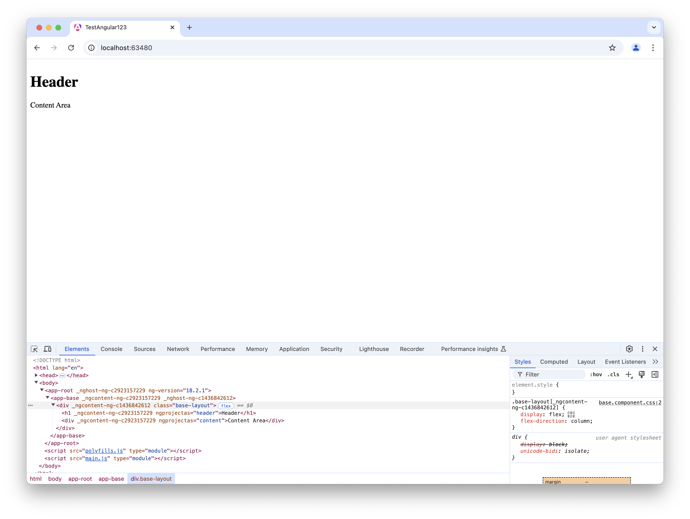

# How To: Building Apps using Angular

Diese Anleitung dreht sich um das Erstellen von Apps mit Angular Components. Es vertieft die Basics wie man mit Components arbeitet und welche Möglichkeiten es gibt verschiedene Darstellungen leicht und unkompliziert zu erstellen.

**Vorraussetzung**

- Ein Text Editor ist installiert (bspw. [Visual Studio Code](https://code.visualstudio.com/))
- Grundlagen von NodeJS & NPM (bspw: [Package Installation](../nodejs//package-installation.md))
- First Steps in Angular (bspw: [Getting Started](../angular/01-getting-started.md))
- Angular Projekt (Das aus First Step kann wiederverwendet werden)

**Inhalt**

- Composing of Components
- State in Angular Components
- Bedingungen, Schleifen, Events und Parent <-> Child Components (Smart and Dumb Concept)

Diese Anleitung basiert auf Angular Version 18 und verwendet Standalone Components.

## Erstellung einer Landing Page

> [!NOTE]
> In diesem How To erstellen wir eine fiktive Anwendung die als Überwachung von verschiedenen Maschinen / Geräten dient. Die Anwendung ist in verschiedene Bereiche unterteilt auf der ein User verschiedene Informationen findet. Es gibt einen Header, eine Sidebar und einen Landing Page Bereich der verschiedene Charts mit kombinierten Informationen anzeigt. Darüber hinaus gibt es eine einheitliche Darstellung für eine Maschine die wiederverwendet wird. Diese Bereiche wollen wir einmal mit Angular bauen.

Als erstes werden wir das Grundlegende Layout als Components darstellen. Diese Components sind auch "Base" Components wir legen diese aber in einen einzelnen Ordner "Layouts" wo wir später alle Layout Components haben.

Für Layout Components verwenden wir ein besonderes Konzept in Angular (Und allgemein in der Webentwicklung) "Content Projection" bzw. "Slots".

Layout Components wrappen meistens andere Components um diese zu positionieren oder zu stylen. In unserem Fall gibt es bspw. eine Layout Component die einen Header, eine Seitenavigation und einen Content Bereich hat. Was in diesen Bereichen aber für Components wirklich verwendet werden können wir dann in der "Layout" Component entscheiden. Theoretisch wäre es also auch möglich in der Sidebar ein Formular zu haben.

Erstellt im `app` Ordner einen neuen Ordner `layouts` und generiert dann über die Angular CLI folgende Components:

- base
- header
- content

Der Befehl ist:

```bash
ng g component layouts/<name>
```

Die Base Component ist unser "Root" Layout es unterteilt die Anwendung in einen Header und einen Content Bereich. Der Content Bereich hat eine Sidebar und den eigentlichen Inhalt der Seite. Im Header können wir bspw. Name der Anwendung, Logo und User Informationen anzeigen.

Damit wir es später einfacher haben können wir jetzt schon alle neuen Components in der `app.component.ts` importieren:

```ts
@Component({
  selector: 'app-root',
  standalone: true,
  imports: [
    RouterOutlet,
    ButtonComponent,
    BaseComponent, // New
    ContentComponent, // New
    HeaderComponent, // New
  ],
  templateUrl: './app.component.html',
  styleUrl: './app.component.css',
})
export class AppComponent
```

In der `base.component.html` fügen wir anschließend folgendes template hinzu:

```html
<div class="base-layout">
  <ng-content select="header"></ng-content>
  <ng-content select="content"></ng-content>
</div>
```

und die Entsprechende CSS Klasse unter `base.component.css`:

```css
.base-layout {
  display: flex;
  flex-direction: column;
}
```

anschließend entfernen wir in der `app.component.html` den vorherigen Inhalt und fügen folgendes Template hinzu, speichern alles und schauen uns das Ergebnis im Browser an:

```html
<app-base>
  <h1 ngProjectAs="header">Header</h1>
  <div ngProjectAs="content">Content Area</div>
</app-base>
```



In der `base.component.html` definieren wir zwei besondere Tags `<ng-content>`. Components haben häufig die Anforderung unterschiedlichen Content anzuzeigen jenachdem wie diese eingesetzt werden. Ein einfaches Beispiel ist eine Component mit einem Icon und Text. Das Icon ist häufig abhängig vom gewählten Text. Im ersten Moment könnte man das Icon als Input Property übergeben und in der Component eine Icon Component nutzen und den Input übergeben. Alternativ könnte man auch mit verschiedenen If Conditions arbeiten und für eine Auswahl an Texten das Icon setzen. Aber was wäre wenn wir einfach von der Parent Component unsere eigene Icon Component mitgeben können die an einer Stelle angezeigt werden soll?

Hier kommt `<ng-content>` ins Spiel. Mit diesem Element können wir einen "Slot" markieren andem eine andere Component gerendert werden soll. Über die `select` Attribute können wir diesen Slots auch noch Namen geben und in der Parent Component referenzieren. In der `app.component.html` übergeben wir zwei Components (In diesem Fall einfach HTML Elemente) und definieren mit `ngProjectAs` an welchen "Slot" diese gerendert werden sollen.

Dieses Konzept möchten wir jetzt einmal vertiefen und bauen die anderen Layout Components beginnend mit dem Header der Anwendung. Zuerst fügen wir folgendes Template in die `header.component.html` hinzu:

```html
<div class="header-container">
  <div class="header-title">
    <h3>Machine Monitoring</h3>
  </div>
  <div class="header-information">
    <div class="header-information-version">
      <span>Version: <b>1.0.0</b></span>
    </div>
  </div>
</div>
```

Und die dazugehörigen CSS Klassen Definitionen:

```css
.header-container {
  display: flex;
  flex-direction: row;
  align-items: center;
  height: 68px;
  background-color: floralwhite;
  justify-content: space-between;
  padding-left: 24px;
  padding-right: 24px;
}

.header-title {
}

.header-information {
}

.header-information-version {
}
```

> [!TIP]
> Es bietet sich an in der `styles.css` im `src` Ordner die globale Margin die einige Browser hinzufügen zu entfernen. Dafür fügen wir folgendes ein: `body {
  margin: unset;
}`

Jetzt tauschen wir die vorherige "Header" Component in der `app.component.html` gegen die neue aus und speichern alles:

```html
<app-base>
  <app-header ngProjectAs="header"></app-header>
  <div ngProjectAs="content">Content Area</div>
</app-base>
```

Auf unserer Webseite sollten wir jetzt eine Headerbar angezeigt bekommen. Die Positionierung übernimmt unsere `base` layout component. Welchen Header wir anzeigen wollen können wir in der `app.component.html` entscheiden.

Fällt euch etwas auf was wir verbessern können in der Header Component?

Die Version ist aktuell hardgecoded im Template. Besser wäre es wenn die Version entweder über eine API, Environment Datei oder sonstige Business Logik kommt. Aus diesem Grund verändern wir die Header Component und bieten einen Input an der die Version entgegen nimmt. Öffnet dazu die `header.component.ts` und fügt folgendes hinzu:

```ts
export class HeaderComponent {
  @Input({ required: true }) version!: string;
}
```

und im Template folgendes:

```html
<span>Version: <b>{{version}}</b></span>
```

Anschließend in der `app.component.html` übergeben wir eine fiktive Versions Nummer an die Header Component (Wir werden hier später eine Service Anbindung etc. bauen):

```html
<app-header ngProjectAs="header" [version]="'1.0.0'"></app-header>
```

Jetzt erweitern wir unsere `content.component.ts` mit der eigentlichen Implementierung. Die Content Component beinhaltet die Seitennavigation und die Hauptansicht der Anwendung. Zuerst erstellen wir einen neuen Ordner `base` und eine `sidebar` component. Die Sidebar hat auch einen Header Bereich und soll eine Liste an Machinen darstellen.