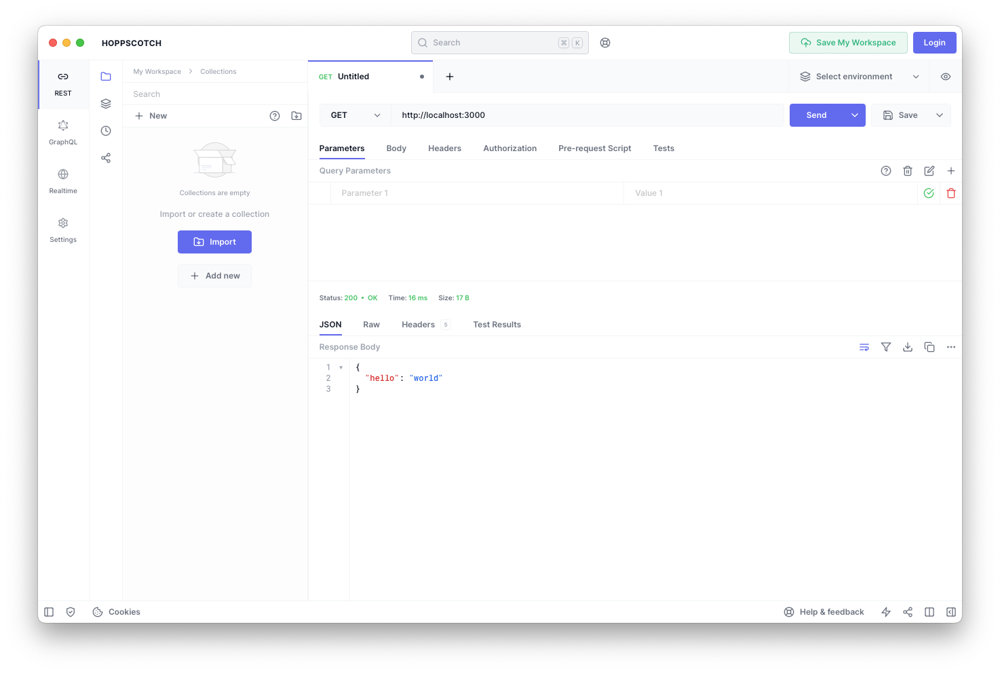

# How To: Fastify Web Server aufsetzen

Diese Anleitung erklärt wie man mit dem Fastiy Framework und NodeJS einen ersten Web Server aufsetzen kann.
Dieser Web Server kann dann auf HTTP Anfragen reagieren und bspw. von Webseiten oder anderen Servern konsumiert werden.

**Vorraussetzung**

- Grundlagen JavaScript sowie NodeJS
- Ein Text Editor ist installiert (bspw. [Visual Studio Code](https://code.visualstudio.com/))
- NodeJS ist installiert (bspw. [NodeJS](https://nodejs.org/en/))
- Hoppscotch als API Test Tool (https://hoppscotch.io/de) ist installiert

## Fastify Projekt aufsetzen

Erstellt auf eurem Dateisystem einen neuen Ordner für den Webserver. Öffnet diesen Ordner in Visual Studio Code. Öffnet nun das Terminal (Header -> Terminal -> New Terminal) in Visual Studio Code und führt folgenden Befehl aus:

```bash
npm init 
```

Es werden nun einige Aufforderungen angezeigt. Diese könnt ihr alle mit Enter bestätigen. Am Ende wird eine `package.json` Datei erstellt. Diese Datei enthält alle Informationen über das Projekt sowie die Abhängigkeiten. Als nächstes ändern wir das Modul Format auf `ESModules`. Öffnet hierfür die `package.json` Datei und ändert das `type` Feld auf `module`. (Wenn noch kein `type` property vorhanden ist könnt ihr dieses einfach hinzufügen)

```json
{
  "name": "@wasdjens/etur-customer-server",
  "version": "1.0.0",
  "description": "",
  "main": "index.js",
  "scripts": {
    "test": "echo \"Error: no test specified\" && exit 1"
  },
  "author": "",
  "license": "ISC",
  "type": "module",
  "dependencies": {}
}
```

Jetzt installieren wir Fastify. Führt hierfür folgenden Befehl aus:

```bash
npm install fastify
```

Fastify ist nun installiert. Als nächstes erstellen wir eine `index.js` Datei. Diese Datei enthält den Code für unseren Webserver. Fügt folgenden Inhalt in die `index.js` Datei ein:

```js
import Fastify from 'fastify'
const fastify = Fastify({
  logger: true
})

// Declare a route
fastify.get('/', async function handler (request, reply) {
  return { hello: 'world' }
})

// Run the server!
try {
  await fastify.listen({ port: 3000 })
} catch (err) {
  fastify.log.error(err)
  process.exit(1)
}
```

## Erläuterung des Fastify Codes

Diese 17 Zeilen JavaScript Code sind alles was wir benötigen um einen WebServer mittels NodeJS abzubilden. Unser Webserver kann nun auf die HTTP Anfrage `/` reagieren und gibt ein JSON Objekt zurück. Aber was machen wir hier eigentlich genau? 

```js
import Fastify from 'fastify'
```

Wir haben mit dem Befehl `npm install fastify` ein so genanntes Node Package installiert (Dieses findet ihr auch innerhalb der package.json) damit wir nun auf die Funktionen aus diesem Package zugreifen können müssen wir es importieren. Die Sytnax für das Importieren ist hierbei besonders nämlich nutzen wir bereits die moderne `ESM` Module Syntax (Anstelle von `CJS`) und können somit `import` und `export` verwenden. 

```js
const fastify = Fastify({
  logger: true
})
```

Als nächstes wird ein Fastify Objekt erstellt hierfür verwenden wir die zuvor importierte Funktion `Fastify` aus dem Modul und geben noch einen speziellen Parameter mit welcher das Logging aktiviert.
In unserer `fastify` Variable haben wir nun ein Fastify Objekt welches wir verwenden können um bspw. Routen zu definieren oder den Server zu starten. Es beinhaltet also den eigentlichen "Web Server".

```js
fastify.get('/', async function handler (request, reply) {
  return { hello: 'world' }
})
```

Jetzt kommt etwas besonderes und die erste Funktion die es uns ermöglicht HTTP Anfragen entgegen zunehmen. In der Theorie kann ein Client jede beliebge HTTP Anfrage an uns (Server) schicken. Ob der Server allerdings mit der Anfrage umgehen kann oder nicht definieren wir in sogenanten Routen. Eine Route beschreibt dabei folgende Dinge:

- Welche HTTP Methode wird angenommen?
- Auf welche URL wird reagiert?
- Was passiert wenn eine Anfrage an diese URL mit dieser Methode ankommt?
- Was hat uns der Client geschickt (HTTP Anfrage)
- Mit was antworten wir dem Client (HTTP Antwort)

Zerlegen wir einmal das obige Beispiel:

- `fastify.get` ist eine built-in Methode von Fastify und kann verwendet werden um auf HTTP GET Anfragen zu reagieren.
- `('/',)` der erste Parameter an die `.get` Methode ist die URL auf die reagiert werden soll. Bspw wenn ein Client jetzt folgende HTTP Anfrage macht: `GET http://localhost:3000/` wird diese Route "getroffen".
- `async function handler(request, reply)` der zweite Parameter ist eine sogennante `Callback` Funktion und wird an die `.get` Methode übergeben damit diese unsere Funktion ausführt wenn eine HTTP Anfrage ankommt. Bedeutet: Der User schickt eine HTTP Anfrage an uns, Fastify versucht die Anfrage einer Route und HTTP Methode zuzuordnen. Wenn es eine gefunden hat führt es die Funktion aus die wir als zweiten Parameter übergeben. Wir verwenden also das Grundprinzip der Funktionalen Programmierung und übergeben eine Funktion als Parameter an eine andere Funktion.
- `(request, reply)` sind zwei Parameter die wir an unseren eigenen Handler übergeben bekommen von Fastify und dahinter vergeben sich zwei Dinge. Der `request` Parameter beinhaltet alles aus der HTTP Anfrage vom Client also bspw. Header Informationen. Der `reply` Parameter ist ein Objekt mit dem wir die HTTP Antwort vom Server modifizieren können also bspw. einen anderen Status Code setzen im Fehlerfall. 

Die letzte Zeile `return` ist das was wir an den Client schicken. Fastify setzt für uns automatisch die entsprechenden HTTP Header um die Antwort als JSON zu verschicken.

```js
try {
  await fastify.listen({ port: 3000 })
} catch (err) {
  fastify.log.error(err)
  process.exit(1)
}
```

Der letzte Abschnitt ist der Programmteil welcher den Server startet und diesem einen Port übergibt. Auf diesem Port hört dann anschließend unser Webserver und wir können HTTP Anfragen schicken. Falls etwas schief geht wird ein Fehler geworfen und wir loggen diesen.

## Mit dem Webserver interagieren

Jetzt wo wir einen Webserver haben können wir diesen auch testen. Öffnet hierfür ein neues Terminal in Visual Studio Code und führt folgenden Befehl aus:

```bash
node index.js
```

Im Terminal sollte jetzt ein Log Eintrag auftauchen wenn der Server erfolgreich gestartet ist. Öffnet nun Hoppscotch.

In Hoppscotch macht ihr einen neuen Request (Auf das `+` klicken) und wählt als Methode `GET` aus und tippt als URL: `http://localhost:3000` ein und klickt anschließend auf `Send`.



Wenn alles geklappt hat solltet ihr nun eine HTTP Antwort sehen mit dem Inhalt:

```json
{
  "hello": "world"
}
```

Darüber findet ihr jetzt Informationen wie bspw. HTTP Status Code und wie lange die Anfrage gedauert hat.

## Fazit

Wir haben jetzt die Grundlagen vom Fastify Framework kennengelernt und können unseren ersten eigenen Web Server schreiben. Wenn wir eine andere HTTP Methode ansprechen möchten oder eine weitere Route können wir diese einfach in unserer `index.js` ergänzen und danach den Server neustarten. 

```js
fastify.post('/', async function handler (request, reply) {
  return { hello: 'world' }
})
```