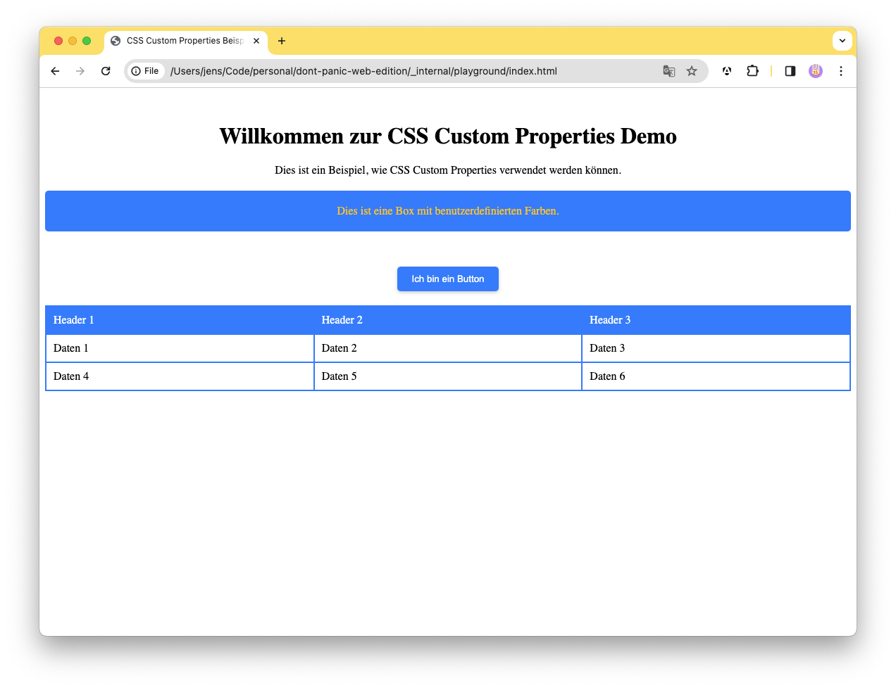

# How To: Using CSS Variables

Diese Anleitung erklärt wie man mit CSS Variablen (Custom Properties) arbeiten kann. Als Beispiel werden global Variablen definiert um die Allgemeine Design Sprache von einer Webseite zu definieren.

**Vorrausetzung**

- Ein Text Editor ist installiert (bspw. [Visual Studio Code](https://code.visualstudio.com/))
- Grundlagen HTML & CSS
- Eine Leere HTML Seite sowie eine `styles.css` Datei die im HTML Eingebunden ist

## Ausgangsbeispiel

Kopiert euch zuerst die Ausgangs HTML Seite in eure `index.html`:

```html
<!DOCTYPE html>
<html lang="en">
  <head>
    <meta charset="UTF-8" />
    <meta name="viewport" content="width=device-width, initial-scale=1.0" />
    <title>CSS Custom Properties Beispiel</title>
    <link rel="stylesheet" href="styles.css" />
  </head>
  <body>
    <div class="container">
      <h1>Willkommen zur CSS Custom Properties Demo</h1>
      <p>
        Dies ist ein Beispiel, wie CSS Custom Properties verwendet werden
        können.
      </p>
      <div class="box">Dies ist eine Box mit benutzerdefinierten Farben.</div>
    </div>
  </body>
</html>
```

Kopiert anschließend folgende CSS Definitionen in eure `styles.css` Datei:

```css
:root {
  --primary-color: #007bff;
  --secondary-color: #ffc107;
}

.container {
  text-align: center;
  margin-top: 50px;
}

.box {
  background-color: var(--primary-color);
  color: var(--secondary-color);
  padding: 20px;
  margin-top: 20px;
  border-radius: 5px;
}
```

Speichert beide Dateien und öffnet die `index.html` in eurem Browser. Ihr solltet nun eine Webseite sehen mit einer Blauen Box und Gelben Text.

Wir können jetzt unsere Lösung um einen Button erweitern und die Definition von unseren Buttons soll als Custom Properties global definiert werden. Dadurch werden alle Buttons die wir später verwenden immer identisch aussehen.

Erweitert eure CSS `:root` Definition um folgende Werte:

```css
:root {
  --button-shadow: 0 2px 5px rgba(0, 0, 0, 0.2);
  --button-border-radius: 5px;
  --button-background-color: var(--primary-color);
  --button-text-color: white;
  --button-hover-background-color: #0056b3;
}
```

Als nächstes führen wir eine Button Regel ein:

```css
button {
  display: inline-block;
  padding: 10px 20px;
  border: none;
  border-radius: var(--button-border-radius);
  background-color: var(--button-background-color);
  color: var(--button-text-color);
  text-align: center;
  text-decoration: none;
  cursor: pointer;
  box-shadow: var(--button-shadow);
}

button:hover {
  background-color: var(--button-hover-background-color);
}
```

Anschließend erweitern wir unsere HTML Seite um einen Allgemeinen Button. Fügt diese Änderung unter den ersten `div` Container ein:

```html
<div class="container">
  <button>Ich bin ein Button</button>
</div>
```

Speichert alle Änderungen und ladet die Seite im Browser neu. Es sollte jetzt ein Button unter dem Text erscheinen. Wenn ihr mit der Maus über den Button fahrt, sollte sich die Hintergrundfarbe ändern.

## Grid Beispiel

Als nächstes wollen wir unserer Seite ein Tabellen Layout in Form von einem CSS Grid hinzufügen und die Default Werte über Custom Properties definieren.

Zuerst erweitern wir unsere HTML Seite um folgende Elemente:

```html
<div class="table-container">
  <div class="row header">
    <div class="cell">Header 1</div>
    <div class="cell">Header 2</div>
    <div class="cell">Header 3</div>
  </div>
  <div class="row">
    <div class="cell">Daten 1</div>
    <div class="cell">Daten 2</div>
    <div class="cell">Daten 3</div>
  </div>
  <div class="row">
    <div class="cell">Daten 4</div>
    <div class="cell">Daten 5</div>
    <div class="cell">Daten 6</div>
  </div>
</div>
```

Jetzt erstellen wir die Verschiedenen CSS Regeln. Wir verwenden hier auch eine Media Query um die Tabelle auf kleinen Größen entsprechend umzubrechen. Als erstes definieren wir eine neue Globale Variable um die Anzahl der Spalten zu definieren.

```css
:root {
  --grid-columns-desktop: repeat(3, 1fr);
  --grid-columns-mobile: 1fr;
}
```

Hier legen wir direkt zwei Werte fest einen für Desktop und einen für Mobile. Dann erstellen wir die Regeln für die eigentliche Tabelle:

```css
.table-container {
  display: grid;
  grid-template-columns: var(
    --grid-columns-desktop
  ); /* Verwende die benutzerdefinierte Variable */
  border: 1px solid var(--primary-color);
  border-collapse: collapse;
  margin-top: 20px;
}

.row {
  display: grid;
  grid-template-columns: var(
    --grid-columns-desktop
  ); /* Verwende die benutzerdefinierte Variable */
}

.cell {
  padding: 10px;
  border: 1px solid var(--primary-color);
}

.header {
  background-color: var(--primary-color);
  color: white;
}
```

Anschließend erstellen wir die Media Query um die Tabelle auf kleinen Bildschirmen umzubrechen:

```css
@media (max-width: 600px) {
  .row {
    grid-template-columns: var(--grid-columns-mobile);
  }
}
```

Wenn wir jetzt das Fenster verkleinern, sollte die Tabelle auf eine Spalte umgebrochen werden.

## Fazit

CSS Custom Properties sind ein mächtiges Werkzeug um die Software Philosohpie DRY (Dont Repeat Yourself) auf CSS Regeln anzuwenden. Sie erlauben es uns, Werte zu definieren die global in der gesamten Webseite verwendet werden können. Dadurch können wir das Design einer Webseite an einer zentralen Stelle definieren und müssen nicht mehrere Stellen im Code anpassen.

Im obigen Beispiel haben wir so eine Definition für die Farben, Schatten und Rundungen von Buttons und Tabellenzellen definiert. Diese Werte können wir dann in den entsprechenden Regeln verwenden und müssen nicht mehrere Stellen im Code anpassen.

Als Endergebnis sollte die Webseite so aussehen:


