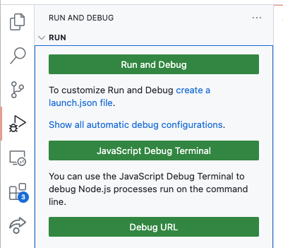
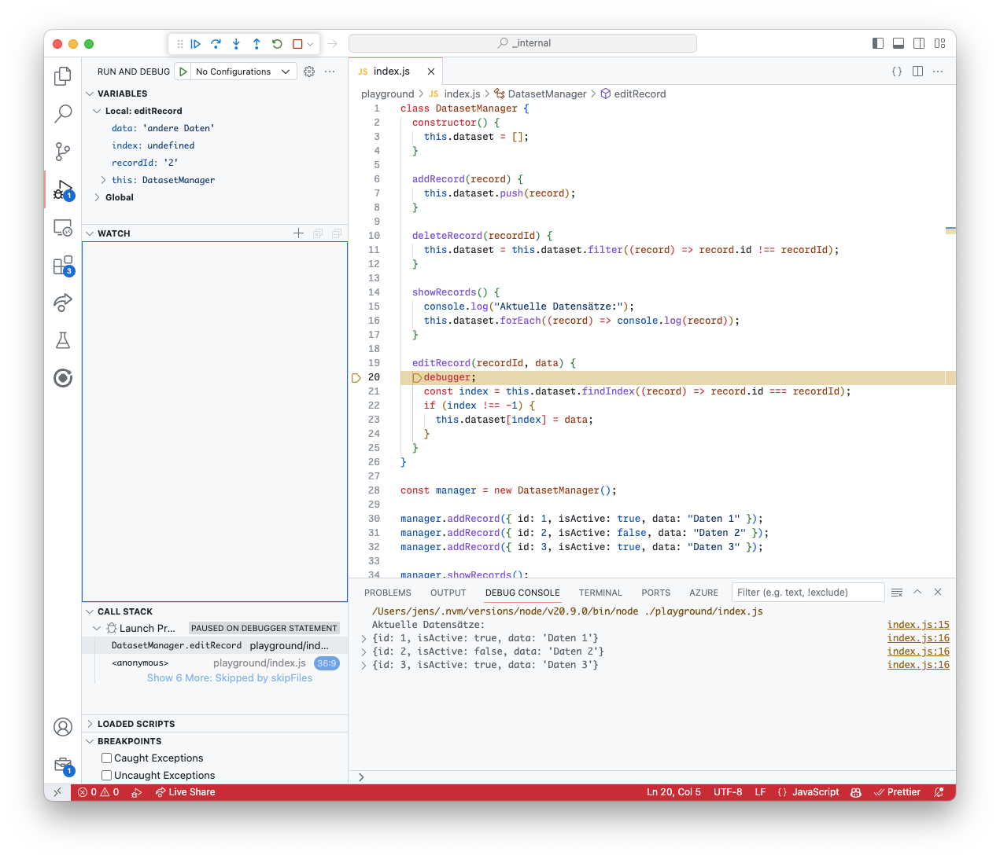
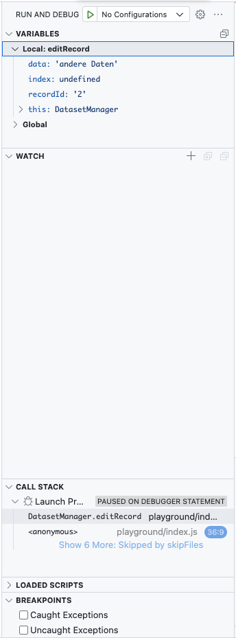

# How To: Debugging in JavaScript

In dieser Anleitung wird erklärt wie man Programmfehler innheralb von JavaScript ausfindig machen kann und welche Werkzeuge out-of-the-box dafür zur Verfügung stehen. Ziel ist es mit den Debugging Tools vertraut zu werden und einen einfachen Programmfehler ausfindig zu machen.

**Vorrausetzung**

- Ein Text Editor ist installiert (bspw. [Visual Studio Code](https://code.visualstudio.com/))
- Grundlagen JavaScript
- Eine `index.js` Datei sowie NodeJS zum ausführen von dieser Datei

## JavaScript Code

Als erstes kopiert euch folgendes Programm in eine `index.js` Datei:

```js
class DatasetManager {
  constructor() {
    this.dataset = [];
  }

  addRecord(record) {
    this.dataset.push(record);
  }

  deleteRecord(recordId) {
    this.dataset = this.dataset.filter((record) => record.id !== recordId);
  }

  showRecords() {
    console.log("Aktuelle Datensätze:");
    this.dataset.forEach((record) => console.log(record));
  }

  editRecord(recordId, data) {
    const index = this.dataset.findIndex((record) => record.id === recordId);
    if (index !== -1) {
      this.dataset[index] = data;
    }
  }
}

const manager = new DatasetManager();

manager.addRecord({ id: 1, isActive: true, data: "Daten 1" });
manager.addRecord({ id: 2, isActive: false, data: "Daten 2" });
manager.addRecord({ id: 3, isActive: true, data: "Daten 3" });

manager.showRecords();

manager.editRecord("2", "andere Daten");

manager.showRecords();
```

Führt dann das Programm einmal aus indem ihr ein neues Terminal Fenster öffnet (Terminal -> New Terminal) und `node index.js` als Befehl eingebt.

Ihr solltet nun folgende Ausgabe sehen:

```

Aktuelle Datensätze:
{id: 1, isActive: true, data: 'Daten 1'}
{id: 2, isActive: false, data: 'Daten 2'}
{id: 3, isActive: true, data: 'Daten 3'}

Aktuelle Datensätze:
{id: 1, isActive: true, data: 'Daten 1'}
{id: 2, isActive: false, data: 'Daten 2'}
{id: 3, isActive: true, data: 'Daten 3'}
```

## Node mit Debugger ausführen

Wenn wir uns den Code genauer anschauen fällt auf, dass wir eigentlich den zweiten Datensatz verändern möchten aber das nichts passiert. Das Programm wird zwar ohne Fehler compiled aber in der eigentlichen Logik scheint ein Fehler zu sein.

Öffnet nun das `Run and Debug` menu von Visual Studio klickt und klickt auf `Run and Debug` in der Auswahl Liste wählt `Nodejs` aus.



Es sollte jetzt das Programm nochmal ausgeführt werden und in der `Debug Console` sollte die Ausgabe stehen. Jetzt möchten wir einmal die Methode `editRecord` Schritt für Schritt durchgehen. Dafür gibt es zwei Möglichkeiten:

- Wir setzen ein `debugger` Statement in den Code.
- Wir setzen einen `breakpoint` in Visual Studio Code.

Versuchen wir zuerst das Spezielle `debugger` statement. Fügt das `debugger` Statement in die `editRecord` Methode ein:

```js
editRecord(recordId, data) {
  debugger;
  const index = this.dataset.findIndex((record) => record.id === recordId);
  if (index !== -1) {
    this.dataset[index] = data;
  }
}
```

Startet nochmal den Node Debugger über Visual Code. Das Programm sollte jetzt während dem Prozess gestoppt werden und ihr seht in Visual Studio Code eine neue Ansicht:



Folgendes ist jetzt passiert:

- Der Node Prozess wurde genau an der Stelle `debugger` gestoppt.
  - 
- Visual Studio bietet ein neues Overlay
  - 
  - Mit dem Play Symbol können wir den Prozess fortführen
  - Mit dem Pfeil nach Rechts können wir den nächsten Programm Schritt ausführen
  - Mit dem Pfeil nach Unten kann tiefer in eine Funktion gesprungen werden
  - Mit dem Pfeil nach Oben kann aus einer Funktion zurück gesprungen werden
  - Mit dem Grünen Pfeil können wir den Debugg Prozess neustarten
  - Mit dem Stop Symbol brechen wir das debuggen ab
- Auf der Linken Seite sehen wir zudem die aktuellen Variablen, Variablen die wir beobachten möchten, den Call Stack und weitere Breakpoints
  - 

Als nächstes klicken wir auf den Pfeil nach Rechts um den nächsten prozess Schritt auszuführen. Die aktuelle Debugger Line sollte jetzt auf die nächste Anweisung gesprungen sein.

Mit einem Klick auf den Pfeil nach unten können wir uns jetzt so die `findIndex` Funktion genauer anschauen. Auf der Linken Seite unter `Variables` sollte jetzt der aktuelle `record` abgebildet sein. Wenn wir jetzt den Pfeil nach Rechts nochmal anklicken gehen wir zum nächsten Record.


Was wir jetzt vielleicht erkennen können ist, dass die eigentliche `id` von einem Record kein `string` ist sondern eine `number`. Und wenn wir jetzt einmal über den Parameter `recordId` rechtsklick machen und `add to watch` auswählen sehen wir auf der linken Seite das der `recordId` ein `string` ist.


Und hier liegt auch der eigentliche Fehler. Der übergebene Parameter ist ein String aber unsere `findIndex` Funktion sucht mit eine strict equal nach der id also `===`. Das bedeutet das wir den Typen und den Wert vergleichen. Da der Typen nicht übereinstimmt wird auch kein Record gefunden und somit auch nicht ersetzt.

Wir können jetzt in der `manager.editRecord()` Zeile den ersten Parameter ändern auf eine `2` anstatt `'2'` und die Datei speichern und den Debugger neu starten. Danach sollte das Programm wieder durchlaufen.

Der Output sieht dann folgendermaßen aus:

```
Aktuelle Datensätze:
{id: 1, isActive: true, data: 'Daten 1'}
{id: 2, isActive: false, data: 'Daten 2'}
{id: 3, isActive: true, data: 'Daten 3'}

Aktuelle Datensätze:
{id: 1, isActive: true, data: 'Daten 1'}
andere Daten
{id: 3, isActive: true, data: 'Daten 3'}

```

Hier fällt uns schnell auf, dass unser `editRecord` noch einen weiteren Fehler hat nämlich überschreiben wir den kompletten Datensatz und nicht nur das Feld `.data` wie angenommen.

Wir können also mit dem Debugger nochmal schauen was beim eigentlichen `editRecord` passiert und sehen, dass innerhalb der Condition `index !== -1` der gesamte Datensatz überschrieben wird und das `.data` fehlt.

Die korrekte `editRecord` Funktion sieht dann folgendermaßen aus:

```js
editRecord(recordId, data) {
  debugger;
  const index = this.dataset.findIndex((record) => record.id === recordId);
  if (index !== -1) {
    this.dataset[index].data = data;
  }
}
```

## Breakpoints

Eine weitere Möglichkeit ist es Breakpoints zu setzen. Dafür klicken wir einfach auf die linke Seite neben der Zeilennummer und setzen einen roten Punkt. Wenn wir dann den Debugger starten wird das Programm an dieser Stelle gestoppt.

## Debugging im Browser

Wenn wir eine Webseite debuggen möchten können wir auf die ähnlichen Werkzeuge zurückgreifen. In unserer JavaScript Anwendung setzen wir einfach ein `debugger` Statement in den Code und öffnen die Webseite im Chrome Browser. Dann öffnen wir die Entwickler Werkzeuge (F12) und klicken auf die `Sources` Tab. Sobald das Debugger Statement erreicht wird stoppt der Browser die Ausführung und wir bekommen ähnliche Controls wie Visual Studio Code.

## Consolen Befehle

Manchmal ist es schwierig mit dem Debugger zu verstehen wo mein Fehler passiert und man möchte lieber sich aktuelle Variablen über die Console ausgeben bzw. nachverfolgen wenn das Programm im normalen "Flow" arbeitet.

JavaScript bietet neben dem `console.log` auch noch weitere Befehle an:

- `console.count(label)` - Zählt wie oft etwas aufgerufen wurde
- `console.trace()` - Gibt den aktuellen Call Stack aus

`count` und `trace` sind zwei sehr mächtige consolen statement Werkzeuge. Mit `count` können wir bspw. prüfen ob eine Funktion (wie ein HTTP Request) mehrfach ausgeführt wird obwohl wir eigentlich nur eine Ausführung erwartet hätten. So etwas deutet häuig auf einen Seiteneffekt hin, dass an einer anderen Stelle die Funktiion auch ausgerufen wird (Ob beabsichtigt oder nicht).

Wenn wir dann noch herausfinden möchten wer eigentlich alles eine Funktion aufruft können wir `console.trace` verwenden. `trace` gibt und den kompletten Funktion Call Stack zurück also sehen wir bspw. die gesamte Kette wer am Ende die Funktion aufgerufen hat und welche anderen Funktionen dabei aufgerufen wurden.

Darüber hinaus kann man sich noch Objekte geordnet ausgeben über den ``console.dir()` Befehl. Alternativ können sich Daten auch noch Tabellarisch ausgeben lassen über `console.table()`.

Und wenn man noch prüfen will wie lange eine Funktion wirklich braucht gibt es `console.time` und `console.timeEnd`. So kann bswp. eine Funktion am Anfang gemessen werden wie lange diese benötigt etwas zu verarbeiten.


## Fazit

Debugging ist ein sehr mächtiges Werkzeug um genau zu verstehen was mein Programm an welcher Stelle macht. Es ist häufig nicht sofort ersichtlich in wie viele Funktionen das Programm eigentlich springt wenn man sich nur den Programm Code anschaut. Das besondere am `debugger` Statement ist, dass wir es auch auf jeder beliebigen Webseite ausführen können um bspw. im Chrome den Debugger zu starten.
