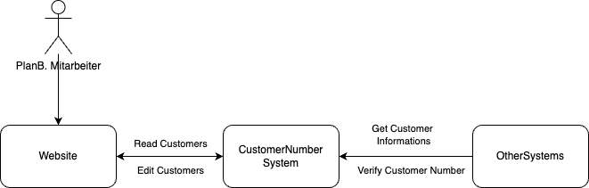
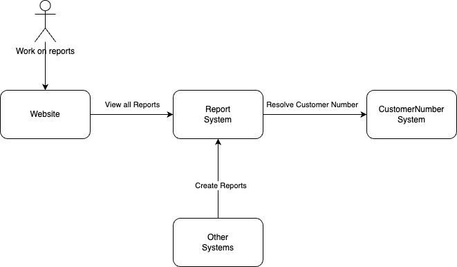

# 02 - Creating the System Design

In diesem Tutorial möchten wir gemeinsam einen System Entwurf für ETUR erstellen. Dabei ist es wichtig die Komplexität gering zu halten und sich nur auf das Notwendigste zu beschränken. Das Ziel ist dabei aus wenig Kundenanforderungen bereits ein grobes Bild vor Augen zu bekommen was für Dienste werden benötigt, welche Dienste müssen miteinander sprechen, was für Technologien kann ich einsetzen? 

## Kommunikation in einem (Verteilten) System

In einem verteilten System ist es wichtig, dass die einzelnen Komponenten miteinander kommunizieren können. Dabei gibt es verschiedene Möglichkeiten wie die Kommunikation ablaufen kann. Anhand dem zuvor vorgestellten Use Case: Was ist die einfachste Kommunikation die ETUR ermöglichen muss?

Um auf diese Frage zu antworten, müssen wir uns zunächst die einzelnen Abläufe anschauen. In unserem Beispiel hat der User eine Email an ETUR geschickt. ETUR hat diese Email erhalten und anhand der Email Adresse den Kunden erkannt. Anschließend wurde der Report automatisch klassifiziert und an den zuständigen Projekt Verantwortlichen weitergeleitet.

Für diesen "einfachen" Fall hat ETUR verschiedene Stationen (oder Systeme) durchlaufen müssen die wir einmal aufzählen (Unvollständig): 

- Email - ETUR ist in der Lage eine Email zu empfangen d.h. es gibt einen Email Server in der Systemlandschaft.
- Zuordnung - ETUR ist in der Lage eine Email einer Kundennummer zuzuordnen. D.h. es gibt ein System welches die Kundennummer kennt und diese zuordnen kann.
- Report - ETUR hat anhand der Email, verschiedenen Klassifieriungen (Diese lassen wir hier weg) einen Report im System erstellt.

Aus dieser Aufzählung möchten wir zwei Systeme hervorheben und genauer betrachten: 

- Kunden Nummer zuordnen
- Report anlegen

Woher kennt das System die Kunden Nummern? 
Wenn das System eine Kunden Nummer erkannt hat wie kann es prüfen ob diese Nummer existiert?
Wie kann man eine neue Kunden Nummer anlegen? 
Wer darf eine neue Kunden Nummer anlegen?

Wenn das System alle notwendigen Informationen gesammelt hat wie kann es einen Report anlegen? Und was sind alles notwendige Informationen damit ein Report Sinnvoll ist? 

Mit welcher Technologie können wir diese beiden Systeme abbilden?

> ✏️ Frage: Welche Technologien die ihr aus dem Alltag kennt würde sich hier anbieten?

> ✏️ Frage: Wie können Daten über ein Netzwerk ausgetauscht werden?

## Ein erster Blueprint

Um uns das ETUR System besser vorzustellen möchten wir mit einem Blueprint beginnen und alle Komponenten sowie Kommunikationswege einzeichen. Keine Sorge wenn der Blueprint im ersten Entwurf nicht perfekt ist, hier geht es viel mehr um ein Verständnis welche Systeme miteinander sprechen müssen.

## Kunden Nummer System

Die erste Frage die man sich stellen kann: Was für Software Komponenten werden benötigt um eine Kundennummer anzulegen und abzufragen?

Aud dieser Frage lassen sich folgende Abläufe herleiten: 

- Man benötigt eine Möglichkeit um eine neue Kunden Nummer anzulegen
  - Was wird alles benötigt um eine Kunden Nummer anzulegen?
- Man benötigt eine Möglichkeit eine gegeben Kunden Nummer zu prüfen (Ist diese Valide oder nicht?)
  - Was passiert wenn eine Kunden Nummer nicht valide ist?
- Man benötigt eine Möglichkeit eine bekannte Kunden Nummer wieder zu entfernen
  - Was passiert mit anderen Komponenten die auf eine Kunden Nummer eine Referenz haben?
- Andere Systeme sprechen mit dem Kunden Nummer System um bspw. Anfragen automatisch zuzuordnen

Wir lassen bewusst das updaten einer Kunden Nummer hier weg. Wenn ein Kunde Änderungen wie bspw. den Firmen Namen ändern möchte muss eine neue Kunden Nummer angelegt werden. 

Die erste Software Komponente von ETUR ist also eine Verwaltung der Kunden Nummern. Jetzt stellt sich die Frage was gehört alles zur Software Komponente "Kunden Nummer". Das erste ist eine Oberfläche für das Anlegen und Verwalten von Kunden Nummern. Die Oberfläche muss darüber hinaus alle Eingaben an das eigentliche System übermitteln. Andere Dienste müssen auch auf Kunden Informationen zugreifen die ggf. automatisch passieren (Vgl. mit einer KI die automatisch Reports zuordnen kann)

> ✏️ Frage: Aus welchen Teilen besteht also unser Kunden Nummer System? 

Eine Möglichkeit wäre folgende Aufteilung: 

- Webseite für das Verwalten von Kunden Nummern
- Schnittstelle für das Abfragen von Kunden Informationen

## Report System

Das Kunden Nummer System ist eigentlich nur ein kleiner Bestandteil von ETUR. Zeigt aber bereits wie viele Fragestellungen sich aus einer einfachen Anforderung ergeben können. Der nächste Blueprint welchen wir erarbeiten möchten ist das Report System. Die Fragestellungen aus dem Kunden Nummer System lassen sich hier adaptieren: 

> ✏️ Frage: Welche Abläufe ergeben sich für das Reporting System?

Auf der höchsten Abstraktion von einem System Design erkennt man schnell, dass sich Grundlegende Abläufe eigentlich immer wiederholen bzw. Ableiten lassen. Ein Überbegriff der gerne für diese Art von Operationen verwendet wird: CRUD (Create, Read, Update Delete). D.h. egal was für ein System man gerade plant man kann immer mit diesen Operationen starten und sich an diesen weitere Fragestellungen definieren. Eine einfache aber meistens unterschätze Frage: Was passiert eigentlich beim Delete?

Diese Frage klingt im ersten Moment banal aber wenn wir alleine das ETUR System betrachten müssen wir uns die Frage stellen: Wenn das Reporting System eine Kunden Nummer auflösen möchte und diese bereits beim Kunden Nummer System gelöscht wurde wie verhält sich das Reporting System? Was passiert mit bereits existierenden Reports? Was passiert auf Datenbank Ebene (Die Ebene wo alle unsere Daten persistent gespeichert werden)

Und auch für das Reporting können wir wieder eine Webseite für die Verwaltung von Reports definieren und eine Schnittstelle auf der andere Systeme zugreifen können.

## Darüber hinaus

Zu jedem System Design gehören natürlich noch viele weitere Bausteine die wir hier nicht explizit aufgezählt haben aber ein Produkt vollfertig abrunden. In den nachfolgenden Tutorials werden wir hier gezielt auf ein paar Punkte eingehen. Für einen ersten Überblick eine (unvollständige) Liste mit weiteren Bausteinen: 

- Identity und Access Systeme
- Logging Systeme
- Monitoring Systeme
- Deployment Techniques
- Testing Techniques
- Infrastructure
- ...

Als erstes möchten wir jetzt die Webseite für das Kunden Nummern System entwerfen.